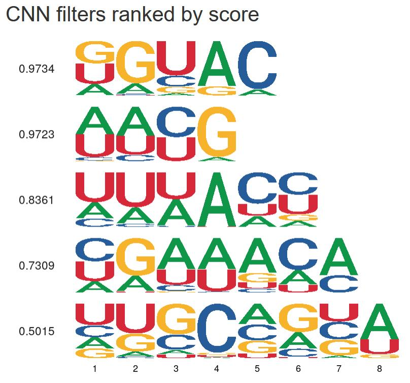

# Bio


In bioinformatics, I was required to reproduce a paper, on which basis to make corresponding experiments and obtain results.The paper focuses on [DeepCLIP][1], a recently proposed tool based on deep learning. DeepCLIP is the first method to model and predict protein binding to RNA nucleic acids using context-aware data as input. 

Table of content
- [Bioinformatics](#bioinformatics)
  - [Usage](#usage)
    - [Training with binding sites alone in BED format or in FASTA format](#training-with-binding-sites-alone-in-bed-format-or-in-fasta-format)
    - [Adjusting training parameters](#adjusting-training-parameters)
    - [Predicting on sequences in single mode.](#predicting-on-sequences-in-single-mode)
  - [Code](#code)
    - [Require](#require)
    - [Structure](#structure)
  - [Example](#example)
    - [Data](#data)
    - [Result](#result)
    - [Bug / Feature Request](#bug--feature-request)
  - [License](#license)


## Usage
- - -
DeepCLIP can be used to train either directly on binding site locations in BED format, or on pre-made positive and negative classes in FASTA format. 

### Training with binding sites alone in BED format or in FASTA format
- - -
You could choose bed.py to train in BED format or you could  execute the following:
```shell
DeepCLIP.py --runmode train -n MODEL -P MODEL_PREDICTION_FUNCTION --sequences POSITIVES.FASTA --background_sequences NEGATIVES.FASTA
```

### Adjusting training parameters
- - -
By default, DeepCLIP partitions the input data such that 80% is used for training, 10% for validation, and 10% for testing. If you wish to change this behaviour you can do so with the '--data_split' option.


### Predicting on sequences in single mode.
- - -
DeepCLIP reads sequence input in FASTA format.


## Code

In order to reproduce the paper, I have searched for numerous related papers and studied technologies like convolutional neural networks,crosslinking-immunprecipitation and high-throughput sequencing, BLSTM and so on to understand the thesis in depth. Due to the limitations of the experiment, I chose to use the sequence data available for prediction in a single mode.
### Require
- - -
The whole codes are based on Python 2.7
- biopython
- htseq
- lasagne
- matplotlib
- mkl-service
- numpy
- scikit-learn
- scipy
- theano


### Structure
- - -
The whole structure of code could be as follows.


## Example
- - -
### Data 
- - -
The data used can be found in Enter the sequence.txt in a single mode.
### Result
- - -
The results can be found in predict results.xlsx including abnormal sequences that can be produced and the possibilities of abnormality of each base of abnormal sequence (with id as TNFRS_F5_E5+5A>T_included example, the specific result of each sequence is in the individual sequence specific prediction result file)

For example, the results of CNN filters:
  
  

### Bug / Feature Request
- - -
If you find a bug (the website couldn't handle the query and / or gave undesired results), kindly open an issue here by including your search query and the expected result.

If you'd like to request a new function, feel free to do so by opening an issue [here][2]. Please include sample queries and their corresponding results.


[1]:http://deepclip.compbio.sdu.dk/
[2]:https://github.com/Greco79/bio/issues


## License
Greco79
